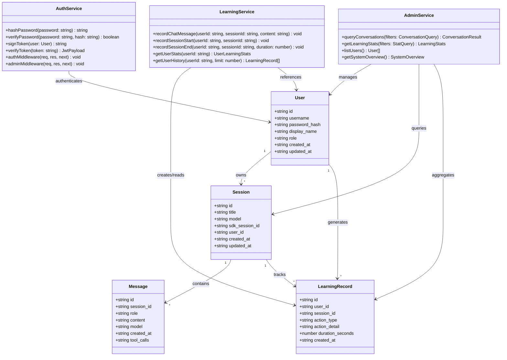
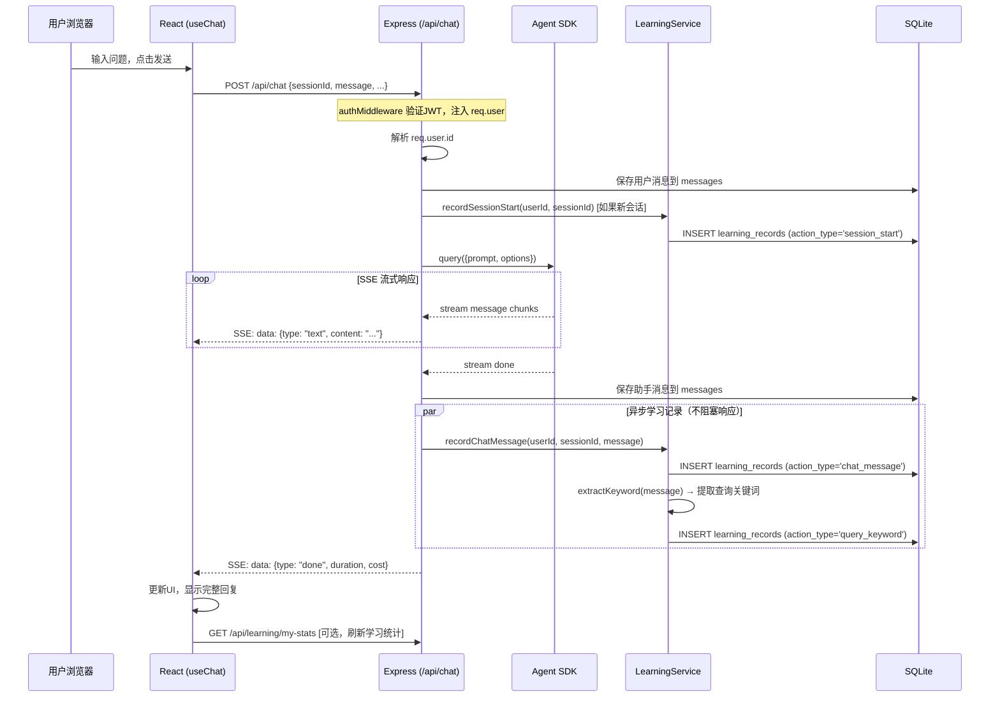
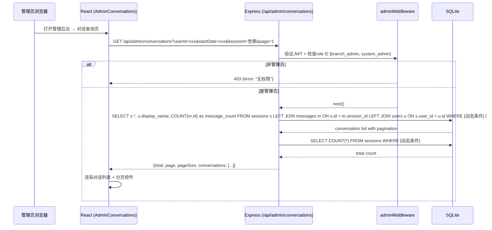
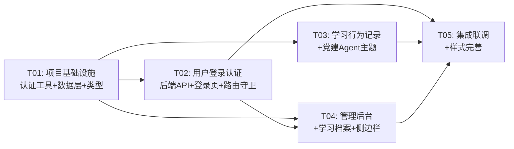

# 党建知识库 Agent Web 应用 — 系统架构设计

> 架构师：高见远（Gao） · 2026-05-29

---

## 1. 实现方案与框架选型

### 1.1 核心技术挑战

| 挑战 | 说明 | 解决方案 |
|------|------|---------|
| 用户认证与权限控制 | 现有系统无认证，需零侵入式添加 | Express 中间件层 + JWT，未登录降级为只读公开模式 |
| 学习行为无感记录 | 不能阻塞对话主流程 | 在 chat SSE 流完成时异步写入 learning_records，不阻塞流式推送 |
| 管理后台与前台共用 Express | 避免端口拆分 | 同一 Express 实例下 `/api/admin/*` 路由组 + adminAuth 中间件 |
| 党建知识领域特化 | System Prompt 需精准引导 | 预置党建知识助手 Agent，含结构化 System Prompt |
| SQLite 并发写入 | 单写锁模型 | WAL 模式已启用，学习记录写入用 `db.transaction` 批量提交 |

### 1.2 在现有模板上扩展的策略

**不改变的核心**：SSE 流式对话、Agent SDK 调用、多会话管理、TDesign UI 框架。

**新增的层次**：

```
现有层（保持）           新增层
┌──────────────┐     ┌──────────────────────┐
│  React UI     │     │  AuthContext + 路由守卫  │
│  (TDesign)    │ ←─ │  LoginPage            │
│  useChat      │     │  LearningBar           │
│  useSessions  │     │  AdminPages            │
├──────────────┤     ├──────────────────────┤
│  Express API  │ ←─ │  authMiddleware       │
│  /api/chat    │     │  /api/auth/*          │
│  /api/sessions│     │  /api/learning/*      │
│  /api/models  │     │  /api/admin/*         │
├──────────────┤     ├──────────────────────┤
│  SQLite DB    │ ←─ │  users 表             │
│  sessions     │     │  learning_records 表   │
│  messages     │     │  sessions 加 user_id   │
└──────────────┘     └──────────────────────┘
```

### 1.3 新增技术依赖

| 包名 | 版本 | 用途 |
|------|------|------|
| `bcryptjs` | ^2.4.3 | 密码哈希（纯 JS，无需 native 编译） |
| `jsonwebtoken` | ^9.0.2 | JWT Token 签发与验证 |
| `cookie-parser` | ^1.4.6 | 解析 httpOnly Cookie 中的 JWT |
| `dayjs` | ^1.11.10 | 前端日期格式化（轻量替代 moment） |

> **不引入**：ORM（直接用 better-sqlite3 prepared statements）、状态管理库（React Context 够用）、UI 框架（TDesign 已满足）。

---

## 2. 文件列表及相对路径

### 新增文件

| 相对路径 | 说明 |
|---------|------|
| `server/auth.ts` | JWT 工具函数、bcrypt 密码验证、认证中间件 |
| `server/learning.ts` | 学习行为记录服务（异步写入、统计聚合） |
| `src/contexts/AuthContext.tsx` | 全局认证状态 Context Provider |
| `src/utils/auth.ts` | 前端认证 API 封装（login/logout/me） |
| `src/pages/LoginPage.tsx` | 登录页面组件 |
| `src/pages/LearningProfile.tsx` | 个人学习档案页面 |
| `src/pages/AdminPage.tsx` | 管理后台布局容器 |
| `src/pages/AdminConversations.tsx` | 管理后台-对话记录查询 |
| `src/pages/AdminLearning.tsx` | 管理后台-学习统计 |
| `src/pages/AdminUsers.tsx` | 管理后台-用户管理 |
| `src/hooks/useAuth.ts` | 认证 Hook（login/logout/user 状态） |
| `src/hooks/useLearning.ts` | 学习行为 Hook（统计查询） |
| `src/components/LearningBar.tsx` | 底部学习提示条组件 |

### 修改文件

| 相对路径 | 修改内容 |
|---------|---------|
| `package.json` | 添加 bcryptjs、jsonwebtoken、cookie-parser、dayjs 依赖 |
| `server/db.ts` | 新增 users/learning_records 表、用户 CRUD、学习记录 CRUD、管理后台查询 |
| `server/index.ts` | 添加 auth/learning/admin API 路由、auth 中间件、学习记录钩入 chat 流 |
| `src/types.ts` | 新增 User、LearningRecord、AdminConversationQuery 等类型 |
| `src/config.ts` | 更新应用名称、添加 JWT 配置 |
| `src/App.tsx` | 添加 AuthProvider、新路由（/login、/profile、/admin/*）、路由守卫 |
| `src/hooks/useAgents.ts` | 默认 Agent 改为党建知识助手、添加党建模板 |
| `src/hooks/useChat.ts` | 对话完成时触发学习行为记录 API |
| `src/components/Sidebar.tsx` | 添加「学习档案」入口、管理员显示「管理后台」入口、登录状态显示 |
| `src/components/Header.tsx` | 添加用户名显示、登录/登出按钮 |
| `src/pages/ChatPage.tsx` | 集成 LearningBar 组件 |
| `src/index.css` | 添加管理后台样式、学习提示条样式、登录页样式 |
| `src/main.tsx` | 可能需微调（如 cookie 相关） |

---

## 3. 数据结构和接口

### 3.1 新增/修改数据库表

```sql
-- 用户表 [新增]
CREATE TABLE IF NOT EXISTS users (
  id TEXT PRIMARY KEY,
  username TEXT NOT NULL UNIQUE,
  password_hash TEXT NOT NULL,
  display_name TEXT NOT NULL,
  role TEXT NOT NULL CHECK (role IN ('party_member', 'branch_admin', 'system_admin')),
  created_at TEXT NOT NULL,
  updated_at TEXT NOT NULL
);

-- 学习行为记录表 [新增]
CREATE TABLE IF NOT EXISTS learning_records (
  id TEXT PRIMARY KEY,
  user_id TEXT NOT NULL,
  session_id TEXT,
  action_type TEXT NOT NULL CHECK (action_type IN ('chat_message', 'query_keyword', 'session_start', 'session_end')),
  action_detail TEXT,           -- JSON: { keyword, topic, question_summary }
  duration_seconds INTEGER,     -- 会话时长（仅 session_end 类型）
  created_at TEXT NOT NULL,
  FOREIGN KEY (user_id) REFERENCES users(id) ON DELETE CASCADE,
  FOREIGN KEY (session_id) REFERENCES sessions(id) ON DELETE SET NULL
);

-- 索引
CREATE INDEX IF NOT EXISTS idx_learning_records_user_id ON learning_records(user_id);
CREATE INDEX IF NOT EXISTS idx_learning_records_session_id ON learning_records(session_id);
CREATE INDEX IF NOT EXISTS idx_learning_records_action_type ON learning_records(action_type);
CREATE INDEX IF NOT EXISTS idx_learning_records_created_at ON learning_records(created_at);
CREATE INDEX IF NOT EXISTS idx_messages_created_at ON messages(created_at);
CREATE INDEX IF NOT EXISTS idx_sessions_user_id ON sessions(user_id);

-- sessions 表新增 user_id 列 [迁移]
ALTER TABLE sessions ADD COLUMN user_id TEXT REFERENCES users(id);
```

### 3.2 类图（Mermaid）



### 3.3 新增 API 接口

#### 认证 API

| 方法 | 路径 | 说明 | 权限 |
|------|------|------|------|
| POST | `/api/auth/login` | 用户名密码登录，返回 JWT（httpOnly Cookie） | 公开 |
| POST | `/api/auth/logout` | 清除 JWT Cookie | 已登录 |
| GET | `/api/auth/me` | 获取当前登录用户信息 | 已登录 |

**POST /api/auth/login**
```
Request:  { username: string, password: string }
Response: { user: { id, username, display_name, role }, token: string }
Cookie:   token=<jwt>; HttpOnly; SameSite=Strict; Path=/; Max-Age=86400
```

**GET /api/auth/me**
```
Response: { user: { id, username, display_name, role } } | { user: null }
```

#### 学习行为 API

| 方法 | 路径 | 说明 | 权限 |
|------|------|------|------|
| POST | `/api/learning/record` | 记录学习行为（前端调用） | 已登录 |
| GET | `/api/learning/my-stats` | 获取当前用户学习统计 | 已登录 |
| GET | `/api/learning/my-history` | 获取当前用户学习历史 | 已登录 |

**GET /api/learning/my-stats**
```
Response: {
  totalSessions: number,
  totalMessages: number,
  totalDuration: number,        // 秒
  topKeywords: string[],        // 高频查询关键词（最多10个）
  recentActivity: LearningRecord[]  // 最近5条
}
```

#### 管理后台 API

| 方法 | 路径 | 说明 | 权限 |
|------|------|------|------|
| GET | `/api/admin/overview` | 系统概览统计 | admin |
| GET | `/api/admin/conversations` | 对话记录查询（支持筛选） | admin |
| GET | `/api/admin/learning-records` | 学习记录查询（支持筛选） | admin |
| GET | `/api/admin/users` | 用户列表 | admin |
| POST | `/api/admin/users` | 创建用户 | system_admin |
| PATCH | `/api/admin/users/:id` | 更新用户信息/角色 | system_admin |

**GET /api/admin/conversations?userId=&startDate=&endDate=&keyword=&page=&pageSize=**
```
Response: {
  total: number,
  page: number,
  pageSize: number,
  conversations: Array<{
    sessionId: string,
    sessionTitle: string,
    userName: string,
    messageCount: number,
    createdAt: string,
    lastMessage: string   // 最后一条消息摘要
  }>
}
```

### 3.4 新增 TypeScript 类型

```typescript
// === 用户相关 ===
export type UserRole = 'party_member' | 'branch_admin' | 'system_admin';

export interface User {
  id: string;
  username: string;
  displayName: string;
  role: UserRole;
  createdAt: Date;
  updatedAt: Date;
}

// === 学习行为相关 ===
export type LearningActionType = 'chat_message' | 'query_keyword' | 'session_start' | 'session_end';

export interface LearningRecord {
  id: string;
  userId: string;
  sessionId: string | null;
  actionType: LearningActionType;
  actionDetail: Record<string, unknown> | null;  // parsed JSON
  durationSeconds: number | null;
  createdAt: Date;
}

export interface UserLearningStats {
  totalSessions: number;
  totalMessages: number;
  totalDuration: number;
  topKeywords: string[];
  recentActivity: LearningRecord[];
}

// === 管理后台相关 ===
export interface ConversationQueryFilter {
  userId?: string;
  startDate?: string;
  endDate?: string;
  keyword?: string;
  page: number;
  pageSize: number;
}

export interface ConversationListItem {
  sessionId: string;
  sessionTitle: string;
  userName: string;
  messageCount: number;
  createdAt: string;
  lastMessage: string;
}

export interface PaginatedResult<T> {
  total: number;
  page: number;
  pageSize: number;
  items: T[];
}

export interface SystemOverview {
  totalUsers: number;
  totalSessions: number;
  totalMessages: number;
  totalLearningRecords: number;
  activeUsersToday: number;
}

// === 认证相关 ===
export interface AuthState {
  user: User | null;
  isLoading: boolean;
  isAuthenticated: boolean;
}

export interface LoginRequest {
  username: string;
  password: string;
}

export interface LoginResponse {
  user: User;
}
```

---

## 4. 程序调用流程

### 4.1 用户登录认证流程

```mermaid
sequenceDiagram
    participant U as 用户浏览器
    participant R as React (LoginPage)
    participant A as Express (/api/auth/login)
    participant DB as SQLite (users)
    participant Auth as AuthService

    U->>R: 输入用户名密码，点击登录
    R->>A: POST /api/auth/login {username, password}
    A->>DB: SELECT * FROM users WHERE username = ?
    DB-->>A: user record (含 password_hash)
    A->>Auth: verifyPassword(password, password_hash)
    Auth-->>A: true/false
    alt 密码正确
        A->>Auth: signToken({id, username, role})
        Auth-->>A: jwt token string
        A-->>R: Set-Cookie: token=<jwt>; HttpOnly + {user}
        R->>R: AuthContext.setUser(user)
        R->>R: navigate('/')
    else 密码错误
        A-->>R: 401 {error: "用户名或密码错误"}
        R->>R: 显示错误提示
    end
```

### 4.2 对话 + 学习行为记录流程



### 4.3 管理后台对话查询流程



---

## 5. 任务列表

### T01: 项目基础设施（认证工具 + 数据层扩展 + 类型定义）

**涉及文件**：`package.json`, `server/auth.ts`, `server/db.ts`, `src/types.ts`, `src/config.ts`, `src/utils/auth.ts`, `src/contexts/AuthContext.tsx`

**说明**：
- 安装新依赖（bcryptjs, jsonwebtoken, cookie-parser, dayjs）
- 实现 JWT 签发/验证、密码哈希/比对工具函数
- DB 层新增 users 和 learning_records 表、迁移 sessions 添加 user_id
- DB 层实现用户 CRUD、学习记录 CRUD、管理后台聚合查询
- 前端类型定义扩展、应用配置更新
- 创建 AuthContext（含 Provider 和 useAuthContext hook）

**依赖**：无（首个任务）

**优先级**：P0

---

### T02: 用户登录认证（后端 API + 前端登录页 + 路由守卫）

**涉及文件**：`src/pages/LoginPage.tsx`, `src/hooks/useAuth.ts`, `server/index.ts`, `src/App.tsx`, `src/components/Header.tsx`

**说明**：
- 后端添加 auth 路由：POST /api/auth/login、POST /api/auth/logout、GET /api/auth/me
- 后端添加 authMiddleware（从 Cookie 解析 JWT，注入 req.user）
- 前端实现 LoginPage 组件（用户名+密码表单，调用登录API）
- 实现 useAuth Hook（登录/登出/获取当前用户状态）
- App.tsx 包裹 AuthProvider，添加 /login 路由，对需要认证的页面添加路由守卫
- Header 组件显示当前用户名、登录/登出按钮

**依赖**：T01

**优先级**：P0

---

### T03: 学习行为记录 + 党建 Agent 主题适配

**涉及文件**：`server/learning.ts`, `server/index.ts`, `src/hooks/useLearning.ts`, `src/hooks/useAgents.ts`, `src/hooks/useChat.ts`, `src/components/LearningBar.tsx`

**说明**：
- 实现 LearningService：异步记录聊天消息、提取关键词、会话开始/结束
- 在 /api/chat 流程中钩入学习记录（chat 完成后异步写入）
- 后端添加 /api/learning/* 路由（my-stats、my-history、record）
- 将默认 Agent 改为「党建知识助手」，systemPrompt 聚焦党建领域
- useChat 在对话完成后调用学习记录 API
- 实现 LearningBar 组件（底部学习提示条：本次学习时长、查询知识点数）

**依赖**：T01

**优先级**：P0

---

### T04: 管理后台 + 学习档案 + 侧边栏扩展

**涉及文件**：`src/pages/AdminPage.tsx`, `src/pages/AdminConversations.tsx`, `src/pages/AdminLearning.tsx`, `src/pages/AdminUsers.tsx`, `src/pages/LearningProfile.tsx`, `src/components/Sidebar.tsx`

**说明**：
- 实现 AdminPage 布局容器（左侧导航 + 右侧内容区）
- 实现 AdminConversations（对话记录查询：用户筛选、时间范围、关键词搜索、分页）
- 实现 AdminLearning（学习记录统计：总览卡片 + 记录列表）
- 实现 AdminUsers（用户管理：用户列表、角色编辑、新建用户）
- 实现 LearningProfile（个人学习档案：统计卡片 + 历史记录）
- Sidebar 新增「学习档案」入口，管理员可见「管理后台」入口，底部显示登录状态

**依赖**：T01, T02

**优先级**：P0

---

### T05: 集成联调 + 样式完善

**涉及文件**：`src/App.tsx`, `src/pages/ChatPage.tsx`, `src/index.css`, `src/components/NewChatView.tsx`

**说明**：
- App.tsx 完成所有路由注册（/login、/、/chat/:sessionId、/profile、/admin/*、/settings）
- ChatPage 集成 LearningBar 组件
- NewChatView 更新默认 Agent 为党建知识助手
- index.css 添加管理后台布局样式、登录页样式、学习提示条样式
- 全流程联调：登录 → 对话 → 学习记录 → 管理后台查询
- 修复集成过程中的边界问题

**依赖**：T01, T02, T03, T04

**优先级**：P0

---

## 6. 依赖包列表

```
- bcryptjs@^2.4.3         : 密码哈希加密（纯JS实现，无需 native 编译）
- jsonwebtoken@^9.0.2     : JWT Token 签发与验证
- cookie-parser@^1.4.6    : Express Cookie 解析中间件
- dayjs@^1.11.10           : 轻量级日期格式化库
- @types/bcryptjs@^2.4.6  : bcryptjs 类型定义
- @types/jsonwebtoken@^9.0.5 : jsonwebtoken 类型定义
- @types/cookie-parser@^1.4.7 : cookie-parser 类型定义
```

---

## 7. 共享知识（跨文件约定）

### 7.1 代码风格

- **TypeScript 严格模式**：所有新文件必须使用 TypeScript，禁止 `any`（泛型除外）
- **函数式组件**：React 组件使用 function 声明 + export，不用 class
- **Hook 命名**：`use` 前缀，如 `useAuth`、`useLearning`
- **API 响应格式**：统一 `{ code: number, data: T, message: string }` 或现有风格 `{ success: boolean, ... }`
- **错误处理**：后端 try-catch 包裹，前端 try-catch + MessagePlugin.error 提示

### 7.2 认证约定

- **JWT 存储**：httpOnly Cookie，SameSite=Strict，Max-Age=24h
- **JWT Payload**：`{ id, username, role }`，过期时间 24 小时
- **中间件导出**：`authMiddleware`（验证登录）、`adminMiddleware`（验证管理员角色）
- **未登录行为**：可访问首页和对话界面，但对话不关联用户；首次对话时提示登录
- **初始管理员**：应用启动时自动 seed 一个 `admin/admin123` 系统管理员账号

### 7.3 数据库约定

- **ID 生成**：UUID v4（与现有代码一致）
- **时间格式**：ISO 8601 UTC 字符串（与现有代码一致）
- **JSON 字段**：action_detail 存储为 TEXT，读取时 JSON.parse
- **迁移方式**：在 db.ts 初始化时用 `ALTER TABLE IF NOT EXISTS` + try-catch

### 7.4 学习记录约定

- **记录时机**：chat 完成后异步写入（不阻塞 SSE 流）
- **关键词提取**：简单策略 — 取用户消息前 20 字作为 query_keyword 的 action_detail
- **会话时长**：前端在 session_start 和 session_end 之间计时，session_end 时上报

### 7.5 党建 Agent Prompt 结构

```
你是「党建知识助手」，专门为基层党组织和党员提供党建知识问答服务。

## 核心能力
1. 党章党规解读：准确引用《中国共产党章程》及相关党内法规
2. 时政要点分析：解读最新的党的方针政策
3. 组织生活指导：指导"三会一课"、民主生活会等组织生活规范
4. 党史学习：中国共产党历史重要事件和人物

## 回答原则
- 内容准确权威，引用具体文件和条款
- 语言简洁明了，便于基层党员理解
- 不确定的内容明确标注，不编造党内法规
- 如问题超出党建范围，温和引导回党建主题
```

---

## 8. 待明确事项

| 编号 | 问题 | 当前假设 | 影响范围 |
|------|------|---------|---------|
| A-1 | 学习行为「关键词提取」的精度要求？ | MVP 用用户消息前 20 字，P1 可接 NLP | LearningService |
| A-2 | 管理后台是否需要操作审计日志？ | MVP 不需要，P1 预留接口 | AdminService |
| A-3 | 党建知识 Prompt 是否需要支持自定义？ | 默认内置，管理员可在设置页修改 | useAgents |
| A-4 | 未登录用户是否可以使用对话功能？ | 可以使用但学习记录不关联用户，提示登录 | authMiddleware |
| A-5 | 文件上传（P1）的存储位置？ | MVP 不涉及，P1 上传到 `data/uploads/` | — |
| A-6 | 多用户并发写入 SQLite 的性能上限？ | MVP 单机部署，预期 <50 并发用户足够 | DB 层 |
| A-7 | 初始管理员密码 admin123 是否需要首次登录强制修改？ | MVP 不强制，但登录页提示修改 | LoginPage |

---

## 9. 任务依赖图



> T01 是所有后续任务的基础；T02 和 T03 可并行开发；T04 依赖 T01+T02；T05 等待所有任务完成后集成。
